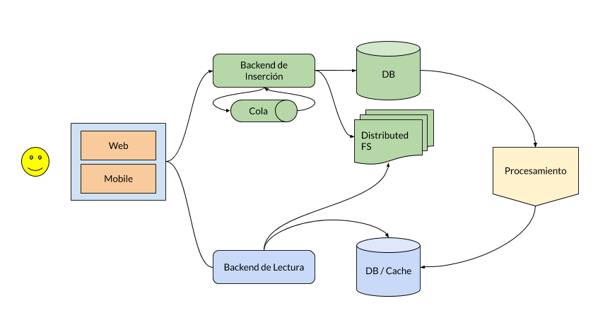

# Guía de resolución de la tarea 3

Este documento es una guía sobre como podría ser la resolución del ejercicio 3 del primer módulo. 

Para empezar, recordemos la descripción de la tarea: 

> Acabas de empezar como arquitecto en una startup que plantea un clon de Twitter. Tu tarea es diseñar el sistema de backend a partir de _componentes existentes_. La idea es que el equipo de ingenieros que vas a dirigir solo tenga que implementar las integraciones entre los distintos componentes.

> El CEO te acaba de dar su visión del producto. Funcionará así:

> Se trata de una especie de clon de Twitter en el que hay distintos niveles de usuarios:
> Premium.
> Standard.
> Free.
> Los usuarios interactuarán con el sistema subiendo textos, vídeos o fotos. Estos datos deben estar siempre disponibles para ser visualizados.
> Los usuarios verán en su pantalla todas las actualizaciones que han realizado los usuarios a quienes siguen. La principal diferencia entre Twitter y este nuevo producto que estás diseñando es que se asegura que siempre se verán las actualizaciones de los usuarios premium, no importa si son viejas: si tú eres un usuario premium, el sistema te asegura que, tu update, la van a ver todos tus seguidores. La actualización estará en el feed de los seguidores hasta que se haya mostrado.
> Si eres un usuario standard, el sistema te asegura que, tu actualización, la van a ver todos tus seguidores siempre y cuando no haya pasado más de una semana.
> Si eres un usuario free, la actualización, la verán tus seguidores que en este momento estén mirando su timeline.
> A efectos prácticos esto significa que el sistema modifica el timeline de cada usuario por prioridades. Primero van a aparecer las actualizaciones de los usuarios premium que el seguidor aún no ha visto; luego, van a salir las actualizaciones de los usuarios standard siempre y cuando no haya pasado más de una semana sin ver la actualización y, después, vendrán las actualizaciones de los usuarios free.
> Este sistema tendrá millones de usuarios, por lo que tiene que escalar y ser rápido.

> Deberás presentar un informe al CEO en el que deberás justificar los sistemas distribuidos que has seleccionado para crear el producto y por qué motivo has elegido unas tecnologías en lugar de otras.

> También deberás explicar qué parte de las funcionalidades se realizan en cada uno de los componentes que has elegido. Por ejemplo, si has elegido un sistema de ficheros distribuido para almacenar las imágenes, ¿por qué esto y no una base de datos?

## Funcionalidades del sistema a sacar del enunciado

Dada la descripción del problema vamos a enumerar las funcionalidades que debe tener el sistema:

* Ingestión de datos (usuarios entrando tweets)
* Tratamiento de datos (los tweets deben ser ordenados especificamente para cada usuario)
* Visualización de datos
* Almacenamiento de multimedia (fotos / videos / ...)

Aparte de esto tenemos los requerimientos no funcionales de que el sistema debe ser escalable y rápido.

## Posible diseño global del sistema

Primero vamos a diseñar un sistema a grosso modo para que pueda satisfacer las funcionalidades del enunciado:

Este diagrama es uno de los muchos que podrían funcionar. En ningún caso esperaba o era necesario que vuestro diseño se pareciera.

Vamos a pasar a hablar del diseño y de sus componentes.

El sistema está divido claramente en tres bloques, inserción de datos (verde), lectura de datos (azul) y procesamiento (amarillo). El sistema de procesamiento podría formar parte de alguno de los otros dos, pero
creo que es mejor tenerlo por separado. Vamos a hablar de ello en su propia sección.

### Sistema de inserción

Esta parte del sistema es la encargada de permitir a los usuarios crear tweets y de guardarlos correctamente. Una idea muy básica es que tendríamos un sistema web que interactúa con una API, esta API forma parte del sistema de backend de ingestión. 

Aquí empiezan los problemas. Tendremos que considerar distintos escenarios para desarrollar el diseño que tenemos: 

* Hay poca inserción de tweets. A lo mejor pues, sólo un servidor con el backend va a bastar. 
* Hay mucha inserción de tweets. Así pues, el sistema de inserción deberá escalar horizontalmente, como lo hacemos?

Para ver como escalamos el backend de ingestión primero debemos saber exactamente qué va a hacer. Una propuesta sería la siguiente: 

* El sistema coge un tweet y lo revisa (que sea correcto, ver si contiene imágenes o video, ...) 
* En caso de que haya "media" tendremos que guardar el fichero (foto/video/...). 
* Tendremos que guardar el contenido de texto del tweet. 
* Tendremos que clasificar el tweet según usuario. 

El backend va a sincronizar estas operaciones. Primeramente va a leer el tweet del frontend web y va a coger su texto. Va a crear la entrada en la base de datos para guardar los datos. En este caso podríamos utilizar perfectamente una base de datos como Cassandra. 

Cassandra escala horizontalmente y aparte de una buena API para inserción y queries también ofrece la posiblidad ser storage de sistemas de proceso como Spark. Una de las grandes ventajas de usar Cassandra es su sistema de particionado y replicación, que va muy ligado al esquema de datos que elijamos. Una vez tengamos los esquemas bien definidos es responsabilidad de Cassandra particionar y repartir los datos en los distintos nodos.

En principio no debería haber problemas, pero en caso de que haya picos de inserciones se podrían solucionar con añadir una cola (Kafka por ejemplo) antes de inserir los datos en Cassandra, de este modo nos aseguramos que no perdemos datos.

El hecho de añadir una cola antes de la inserción de la base de datos tiene la ventaja que nos permite frenar la inserción a la DB en caso de stress de esta. Como gran desventaja añadimos complejidad extra al sistema y el gasto de tener que gestionar más sistemas distribuidos dentro de nuestro sistema.

El esquema de la base de datos es complejo, pero la parte importante en este paso es que tenemos los datos guardados para su posterior uso.

Como hemos dicho, los tweets pueden contener imágenes o videos. Las bases de datos en principio no son los lugares más ideales para guardar este tipo de contenidos. El almacenamiento de media es normalmente de una sóla escritura y muchas lecturas. Creo que cualquier sistema de ficheros distribuido sería ideal para este caso. Personalmente eligiría S3 de Amazon, lo más importante a tener en cuenta aquí es que el sistema de ficheros debe ser replicado y resiliente a fallos, sobretodo de escritura.

En esta práctica lo más importante es no perder datos. Si tenemos en cuenta como funciona Twitter (y cualquier otra red social) la parte importante es que cuando escribimos no perdamos datos.

### Sistema de procesamiento

Una vez tenemos los datos bien guardados tenemos que pensar qué hacer con ellos. En la práctica tenemos distintos tipos de órdenes de aparición de los tweets dependiendo del tipo de usuario. Así pues, una possible solución es crear estas ordenaciones en un proceso "background" para que las lecturas sean mas fáciles, mas rápidas y sobretodo para que añadan el mínimo posible de carga a la base de datos.

Algunas bases de datos permiten hacer queries de lectura complejas. Por ejemplo, si usáramos una base de datos relacional no sería un problema hacer una lectura que ordenara los tweets según usuario. De hecho, es un caso común. Funcionaría hasta cierto punto, pero sin duda pronto daríamos con problemas de performance. Así pués, es una muy buena idea separar los sistemas por funcionalidades y tratar de descargar la DB.

Una idea muy válida es de leer los tweets de la DB (o incluse hacer streaming a partir de ella a medida que los va guardando) e preprocesarlos.

Para ellos nos podemos servir los sistemas de procesado de datos, como son Spark, Hadoop o Flink. La idea básica es ordenar los timelines para cada usuario, de tal modo que estén ya preparados para su lectura cuando el usuario se conecte.

En este caso yo usaría Spark o Flink, ya que ofrecen la posibilidad de realizar operaciones en Streaming (ir procesando los datos a medida que van llegando a la DB). Hadoop es un sistema de procesamiento una generación anterior y no está pensado para realizar este tipo de operaciones en streaming. Para este caso pues, sería usable, pero no el ideal.

Una vez tenemos los timelines preparados podemos almacenarlos en la misma base de datos o incluso en bases de datos más rápidas o sistemas de cache, como podría ser Redis o Memcached.

Al inicio se ha dicho que este sistema podría formar parte del sistema de inserción, y también del sistema de lectura. De hecho, la separación es conceptual, ya que todos interactúan. Pero es siempre mejor separar los sistemas por sus funcionalidades.

### Sistema de lectura

Ya hablamos un poco del sistema de lectura en el punto anterior. Vamos a analizarlo más profundamente en esta sección.

Es probable que la cantidad de lecturas sea mucho mayor a las escrituras, por lo tanto el sistema que se encarga de dar servicio a las lecturas debe ser muy robusto.

Es normalmente una buena idea de separar los datos de lectura y de escritura. Además en este caso no son los mismos. En la fase de inserción hemos insertado unos datos en una DB. Luego hemos procesado estos datos. El resultado del proceso es lo que debemos servir a los usuarios.

Los datos de lectura pueden estar almacenados en Cassandra (así aprovechamos un sistema que ya usamos) o bien en otros sistemas como pueden ser Redis Cluster o incluso Memcached.

En este caso, si usáramos Redis o Memcached deberíamos tener en cuenta sus habilidades para particionar los datos. En este caso deberíamos tener en cuenta las distintas características para particionar los datos y sus efectos en la replicación de los datos. Redis Cluster tiene soporte para dichas operaciones, mientras que si usáramos Memcached el particionado es responsabilidad del cliente. No es un problema, pero lo debemos tener en cuenta. En este sentido, Redis Cluster es probablemente una mejor opción.

No sólo vamos a utilizar una DB/Cache. Hay ciertas funcionalidades que debemos tener en cuenta cuando estamos enseñando los timelines. Es por los siguientes motivos que necesitamos otro backend para la lectura:

* Asegurarse de que algunos tweets son leídos como mínimo una vez. Así pues, hay que marcar los twees como leídos una vez estos se han enviado al frontal para asegurarnos de que no se van a leer de forma indefinida.
* Coger los ficheros de `media` del sistema de ficheros distribuido.

